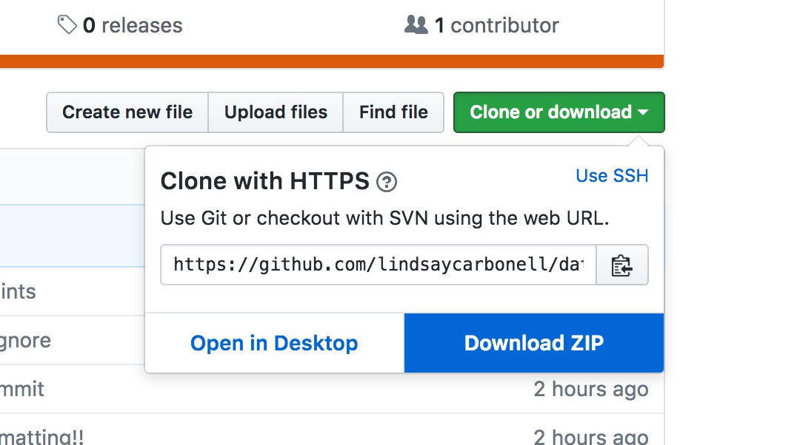
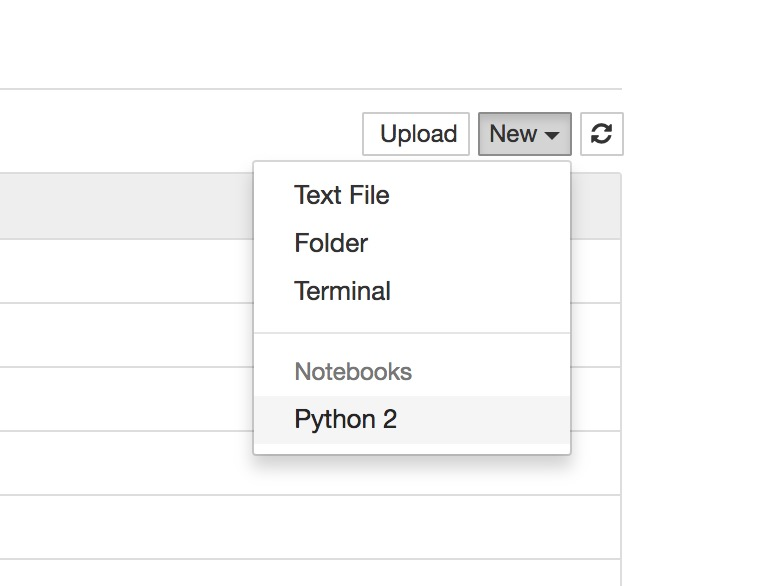

# data-wrangling-python-nicar-2017
This repository contains materials for "Data Wrangling With Python," a hands-on session presented at the 2017 Investigative Reporters and Editors NICAR conference in Jacksonville, Fla.

The code covers basic import, transformation, and export of data from CSV files. Output formats include JSON and SQL table creation statements.

## What You'll Need
This code was written and taught on MacOS Sierra using Python 3.6; it should work fine on Python 2.7 as well as Python 3.5+. It's not been tested on Windows. I recommend setting up a [virtual environment](http://docs.python-guide.org/en/latest/dev/virtualenvs/) and then installing the following dependencies:
- [Jupyter Notebook](http://jupyter.readthedocs.io/en/latest/install.html)
- [Requests](http://docs.python-requests.org/en/master/user/install/)
- [Agate](http://agate.readthedocs.io/)
- [csvkit](https://csvkit.readthedocs.io)

## Getting Started
Once you have installed the dependencies, you can get started! Follow these steps:
 1. Download this repository and save it to your Desktop.
 

 2. Open your terminal and navigate to this folder:

 ``cd Desktop/data-wrangling-python-nicar-2017``
 3. Set up your virtual environment. We'll call it 'nicar':

 ``virtualenv nicar``
 ``source nicar/bin/activate``

 4. Now you can run Jupyter Notebook:

 ``jupyter notebook``

 5. Jupyter Notebook will open in your default browser on ``localhost:8888``. Create a new notebook using the dropdown menu on the right (python 2 or 3 should work):

 

 6. Now you can open up the .ipynb file in this project and paste in the code!

 7. When you're done, run ``ctrl+c`` to close Jupyter Notebook. Then ``deactivate`` to exit your virtual environment.
